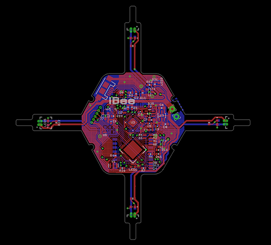
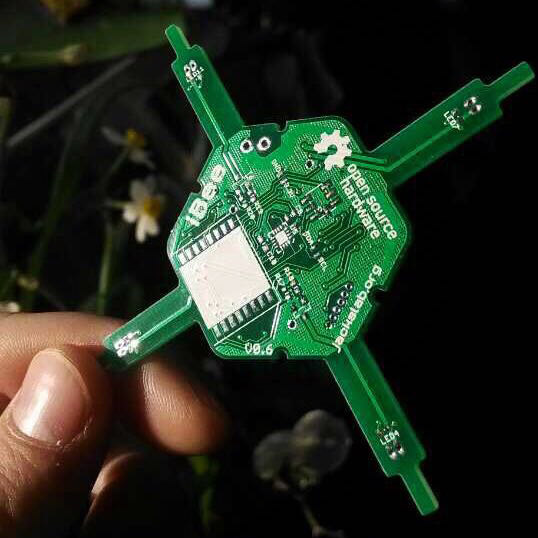

iBee PCB Quadcopter
========================

[*iBee Quadcopter Board PCB Layout (iBee V0.8)*](https://www.jackslab.org/)

[*iBee Quadcopter Board PCB (iBee V0.8)*](https://www.jackslab.org/)

It's based on the control board of Flexbot Quadcopter.

Repository Contents
-------------------
* hardware/V0.8/ - All Eagle design files (.brd, .sch) and Gerber files of iBee version 0.8

License Information
-------------------
The hardware is released under [Creative Commons ShareAlike 4.0 International](https://creativecommons.org/licenses/by-sa/4.0/).

Distributed as-is; no warranty is given.
